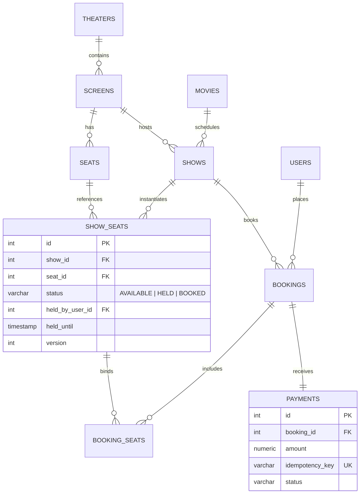

# 🎬 SeatLock: High-Concurrency Cinema Multiplex Engine

[-336791?style=for-the-badge&logo=postgresql&logoColor=white)](https://neon.tech)
[](https://nodejs.org)
[](https://expressjs.com)
[](https://react.dev)
[](https://getbootstrap.com)
[](https://github.com)

A production-grade, transactional cinema multiplex reservation backend designed to handle extreme concurrent booking spikes without race conditions or double bookings. Built on top of **PostgreSQL ACID transactions**, **pessimistic row-level locking (`SELECT ... FOR UPDATE`)**, and **payment idempotency pipelines**.

---

## 📌 The Problem
During blockbuster ticket releases (e.g., Avengers, Oppenheimer), thousands of users rush to click the exact same premium recliner seats simultaneously. Standard CRUD architectures with NoSQL or un-isolated SQL suffer from:
1. **Race Conditions & Double Booking:** Two users pay for and get assigned the exact same seat.
2. **Deadlocks:** Inconsistent seat locking order causes transactions to freeze and crash.
3. **Orphaned / Ghost Holds:** Users select seats, abandon the checkout page, and block other paying customers indefinitely.
4. **Duplicate Charges:** Network timeouts cause users to click "Pay" multiple times, resulting in duplicate charges.

---

## 🏗️ Architecture & Concurrency Strategy

```mermaid
sequenceDiagram
    autonumber
    actor Alice
    actor Bob
    participant API as Express API
    participant DB as PostgreSQL (Neon)

    Note over Alice, Bob: Both click Seat E12 at the exact same millisecond
    Alice->>API: POST /shows/1/hold [Seat E12]
    Bob->>API: POST /shows/1/hold [Seat E12]

    rect rgb(20, 30, 45)
    Note over API, DB: Transaction 1 (Alice)
    API->>DB: BEGIN; SELECT ... WHERE seat_id=12 FOR UPDATE;
    Note over DB: Row lock acquired on E12 for Alice
    API->>DB: UPDATE show_seats SET status='HELD', held_until=NOW()+7m; COMMIT;
    DB-->>API: 200 OK (Seats Held)
    API-->>Alice: 200 OK (Held for 7 minutes)
    end

    rect rgb(45, 20, 20)
    Note over API, DB: Transaction 2 (Bob)
    Note over DB: Bob's transaction was blocked waiting for lock on E12
    DB-->>API: Row released with status='HELD'
    Note over API: Validation check fails: seat is already held!
    API->>DB: ROLLBACK;
    API-->>Bob: 409 Conflict: Seat no longer available
    end
```

### 1. Row-Level Pessimistic Locking
* Uses PostgreSQL's `SELECT ... FOR UPDATE` inside atomic transactions.
* Seat IDs are sorted in ascending order prior to acquisition to guarantee **deadlock-free lock order**.

### 2. Live Dynamic Status Evaluation & Auto-Expiry Sweeper
* Holds expire after **7 minutes**.
* Read queries dynamically treat seats where `status = 'HELD' AND held_until < NOW()` as immediately `AVAILABLE`.
* A background worker cleans up expired rows every 30 seconds to maintain audit integrity.

### 3. Payment Idempotency
* Every checkout request requires an `Idempotency-Key` header.
* Re-sending payments with the same key returns the existing booking record with **zero duplicate charges**.

---

## 📊 High-Concurrency Stress Benchmark Results

We simulated **15 distinct users** attempting to lock the exact same seat at the exact same millisecond against our serverless **Neon PostgreSQL** database:

| Metric | Result |
| :--- | :--- |
| **Simultaneous Contenders** | **15 distinct authenticated users** |
| **Target Contested Seat** | Row A, Seat 2 |
| **Total Test Duration** | **1229 ms** |
| **Successful Holds (`200 OK`)** | **Exactly 1 (Winner)** |
| **Rejected Conflicts (`409 Conflict`)** | **14 (Cleanly rejected)** |
| **Double Bookings Occurred** | **0 (Zero)** |
| **Deadlocks / Unhandled Errors** | **0 (Zero)** |

Run the benchmark yourself anytime:
```bash
cd backend
npm run test:concurrency
```

---

## 🗄️ Relational Schema Design



---

## 🛡️ Security & Zero Vulnerabilities
* **0 Vulnerabilities** (`npm audit` verified on both frontend and backend).
* **100% Parameterized SQL:** Immune to SQL injection.
* **Helmet:** HTTP security headers (XSS, clickjacking, sniff protection).
* **Zod:** Strict input validation and sanitization on all API routes.
* **Bcrypt:** 12 salt rounds for credential hashing.
* **Rate Limiting:** Protects seat locking endpoints against bot ticket scalping.

---

## 🚀 Quickstart Guide

### 1. Environment Configuration
In `backend/.env`:
```env
PORT=5000
DATABASE_URL=your_neon_postgresql_connection_string
JWT_SECRET=super_secret_jwt_key
CLIENT_ORIGIN=http://localhost:5173
HOLD_TIMEOUT_MINUTES=7
```

### 2. Run Database Migrations & Seeder
```bash
cd backend
npm install
npm run migrate    # Creates all 10 relational tables, indexes, and constraints
npm run seed       # Populates multiplex, screens, tiered seats, and shows
```

### 3. Start Backend & Frontend
```bash
# Terminal 1: Backend API
cd backend
npm start          # Runs on http://localhost:5000

# Terminal 2: React Frontend
cd frontend
npm run dev        # Runs on http://localhost:5173
```

---

## 🌐 Deploying to Vercel
1. Push this repository to GitHub.
2. **Backend:** Deploy on **Render** / **Railway** with your `DATABASE_URL` environment variable.
3. **Frontend:** Import the `frontend` folder into **Vercel**, set `VITE_API_URL` to your backend URL, and click **Deploy**!
