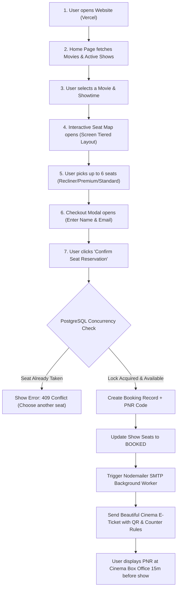
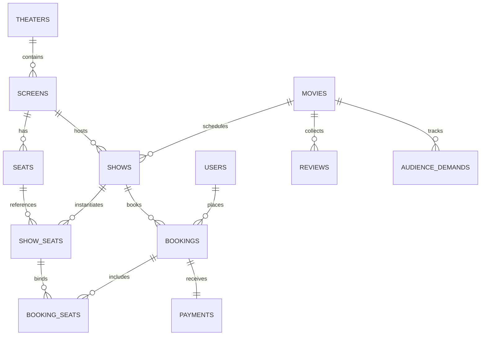
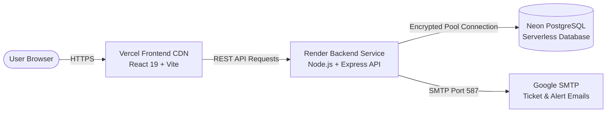

# 🎬 SeatLock: High-Concurrency Cinema Multiplex Engine

[-336791?style=for-the-badge&logo=postgresql&logoColor=white)](https://neon.tech)
[](https://nodejs.org)
[](https://expressjs.com)
[](https://react.dev)
[](https://getbootstrap.com)
[](https://seat-lock-alpha.vercel.app)
[](https://render.com)

> **Live Application**: [https://seat-lock-alpha.vercel.app](https://seat-lock-alpha.vercel.app)  
> **GitHub Repository**: [https://github.com/Ruchitha-2007/seatLock](https://github.com/Ruchitha-2007/seatLock)

---

## 📖 Table of Contents
1. [Project Overview (What is SeatLock?)](#-project-overview)
2. [The Real-World Problem: The Concurrency Rush](#-the-real-world-problem)
3. [How SeatLock Solves It (Zero-Knowledge Explanation)](#-how-seatlock-solves-it)
4. [End-to-End User Journey & Workflow](#-end-to-end-user-journey--workflow)
5. [Core Concepts Explained for Beginners](#-core-concepts-explained-for-beginners)
6. [Complete Codebase Architecture (File-by-File Breakdown)](#-complete-codebase-architecture)
7. [Database Schema & Design](#-database-schema--design)
8. [Audience Demand & Re-Release System](#-audience-demand--re-release-system)
9. [Automated Email Ticketing System](#-automated-email-ticketing-system)
10. [Deployment Architecture](#-deployment-architecture)
11. [Interview Questions & Answers (Cheat Sheet)](#-interview-questions--answers)

---

## 🌟 Project Overview

**SeatLock** is a production-grade, transactional cinema booking platform built to handle the chaos of blockbuster ticket sales (e.g., *Avengers*, *Pushpa*, *Kalki*). 

When a blockbuster movie opens bookings, thousands of fans rush to click the same premium seats at the exact same millisecond. Without proper safeguards, ordinary web applications crash, freeze, or suffer from **double bookings** (selling the exact same seat to two different people).

SeatLock prevents this entirely using **PostgreSQL ACID Transactions** and **Pessimistic Row-Level Locking (`SELECT ... FOR UPDATE`)**.

---

## 💥 The Real-World Problem

Imagine this scenario without SeatLock:

```
Alice and Bob are both trying to book Seat E12 at 10:00:00.000 AM.

1. Alice checks availability -> Database says "Seat E12 is FREE".
2. Bob checks availability   -> Database says "Seat E12 is FREE".
3. Alice clicks "Book"       -> System marks E12 as booked for Alice.
4. Bob clicks "Book"         -> System overwrites E12 and marks it for Bob!
💥 Result: Both Alice and Bob got confirmation for the EXACT SAME SEAT.
```

In standard CRUD applications using MongoDB or naive SQL, this **race condition** happens constantly under high traffic.

---

## 🛡️ How SeatLock Solves It

SeatLock uses PostgreSQL's built-in **Pessimistic Row-Level Locking**:

```mermaid
sequenceDiagram
    autonumber
    actor Alice as 👩 Alice
    actor Bob as 👨 Bob
    participant API as Express API
    participant DB as PostgreSQL (Neon)

    Note over Alice, Bob: Both click Seat E12 at the exact same millisecond
    Alice->>API: POST /api/shows/1/book [Seat E12]
    Bob->>API: POST /api/shows/1/book [Seat E12]

    rect rgb(20, 35, 25)
    Note over API, DB: Transaction 1 (Alice wins race to the database lock)
    API->>DB: BEGIN; SELECT * FROM show_seats WHERE id=12 FOR UPDATE;
    Note over DB: 🔒 Row E12 is LOCKED exclusively for Alice
    API->>DB: UPDATE show_seats SET status='BOOKED'; COMMIT;
    DB-->>API: Success (Transaction Committed)
    API-->>Alice: 200 OK (Reservation Confirmed! PNR Generated)
    end

    rect rgb(35, 20, 20)
    Note over API, DB: Transaction 2 (Bob's request was queued waiting for lock)
    Note over DB: Lock on E12 released by Alice. Bob's query now runs:
    DB-->>API: Returns E12 with status = 'BOOKED'
    Note over API: Validation check: Seat is already booked!
    API->>DB: ROLLBACK;
    API-->>Bob: 409 Conflict: Seat E12 has already been reserved.
    end
```

### The 3 Core Pillars of Concurrency Protection:
1. **`BEGIN` and `COMMIT` (ACID Transactions):** Either all requested seats are booked together, or nothing changes.
2. **`SELECT ... FOR UPDATE` (Pessimistic Locking):** The first user's request locks the specific database row. All other users trying to touch that seat must wait in line.
3. **Sorted Lock Acquisition (`seatIds.sort((a, b) => a - b)`):** Prevents **deadlocks** (where Transaction A holds Seat 1 and waits for Seat 2, while Transaction B holds Seat 2 and waits for Seat 1).

---

## 🔄 End-to-End User Journey & Workflow



---

## 🧠 Core Concepts Explained for Beginners

If you are asked about these in an interview, here is the plain-English explanation:

| Term | What it means in plain English | Where SeatLock uses it |
| :--- | :--- | :--- |
| **API (Application Programming Interface)** | A messenger between frontend and backend. React sends a request (`GET /api/movies`), Express fetches it from PostgreSQL and replies with JSON. | [`frontend/src/services/api.js`](file:///frontend/src/services/api.js) |
| **ACID Transactions** | A guarantee that database operations are **Atomic** (all-or-nothing), **Consistent**, **Isolated** (safe from others), and **Durable** (saved permanently). | In `confirmBooking` and `holdSeats` with `BEGIN` and `COMMIT`. |
| **Pessimistic Locking (`FOR UPDATE`)** | Asking the database: *"Give me this row, and lock it so no other transaction can read or edit it until I am done."* | In seat reservation transactions. |
| **Deadlock Prevention** | When two people hold part of what the other needs, causing both to freeze forever. SeatLock solves this by sorting seat IDs numerically (`1, 2, 3...`) so everyone locks seats in identical order. | In `bookings.controller.js` line ~33. |
| **CORS (Cross-Origin Resource Sharing)** | A security rule in web browsers. Since the frontend is at `vercel.app` and the backend is at `onrender.com`, the backend must explicitly permit `vercel.app` to make requests. | In [`backend/src/app.js`](file:///backend/src/app.js). |
| **JWT (JSON Web Token)** | A digital passport stored in the user's browser after logging in. Every API request carries this token in the `Authorization` header to prove identity. | In `auth.controller.js` and `authMiddleware.js`. |
| **SMTP (Simple Mail Transfer Protocol)** | The protocol used to send emails over the internet. SeatLock uses Gmail SMTP to send automated reservation tickets and cancellation notices. | In [`backend/src/services/emailService.js`](file:///backend/src/services/emailService.js). |
| **Idempotency** | Ensuring that clicking a button multiple times (or refreshing) does NOT create duplicate records or charges. | In payment validation with `Idempotency-Key`. |

---

## 🗂️ Complete Codebase Architecture

```
SeatLock/
├── backend/                  # Node.js + Express API
│   ├── src/
│   │   ├── server.js         # Entry point: starts server, runs migrations
│   │   ├── app.js            # Express config, CORS, Helmet, routes, error handlers
│   │   ├── config/
│   │   │   └── db.js         # PostgreSQL connection pool (pg.Pool)
│   │   ├── db/
│   │   │   ├── migrate.js    # Database migration runner (runs 11 SQL scripts)
│   │   │   ├── seed.js       # Seeds demo movies, theaters, screens, and shows
│   │   │   └── migrations/   # 11 SQL migration files defining tables & indexes
│   │   ├── modules/
│   │   │   ├── auth/         # Login, Register, JWT verification
│   │   │   ├── movies/       # Movie catalog, search, filter, hype votes, reviews
│   │   │   ├── bookings/     # Concurrency engine, seat locking, reservations
│   │   │   ├── demands/      # Audience re-release voting and leaderboard
│   │   │   └── admin/        # Admin panel: add movies, schedule shows, cancellations
│   │   ├── services/
│   │   │   └── emailService.js # Nodemailer SMTP email dispatcher
│   │   └── middlewares/      # Rate limiter, auth guards, input validation (Zod)
│   └── package.json
│
├── frontend/                 # React 19 + Vite Single Page Application
│   ├── src/
│   │   ├── main.jsx          # React DOM entry point
│   │   ├── App.jsx           # Master state manager (modals, auth, current movie/show)
│   │   ├── services/
│   │   │   └── api.js        # Axios instance, baseURL normalization, JWT injector
│   │   └── components/
│   │       ├── Navbar.jsx            # Top navigation bar, search, auth buttons
│   │       ├── MovieList.jsx         # Movie catalog, genre filters, hype counters
│   │       ├── SeatMap.jsx           # Multiplex screen view, tiered seat grid
│   │       ├── CheckoutModal.jsx     # Booking confirmation & counter payment rules
│   │       ├── MyBookingsModal.jsx   # User's active & past tickets with PNR & status
│   │       ├── MovieReviewsModal.jsx # Community movie ratings & reviews
│   │       ├── AudienceDemandModal.jsx # Crowd re-release voting & leaderboard (#1, #2)
│   │       └── AdminPanelModal.jsx   # Admin dashboard: schedule shows, cancel shows
│   ├── vercel.json           # SPA routing rewrite rules for Vercel
│   └── package.json
└── README.md                 # Project documentation
```

### Detailed File-by-File Breakdown:

#### 1. [`backend/src/server.js`](file:///backend/src/server.js)
* **What it does**: The central engine starter.
* **Key lines**:
  * Runs database migrations automatically on startup (`runMigrations()`).
  * Initiates the background hold sweeper worker (`initHoldSweeper()`) running every 30 seconds.
  * Listens on `PORT` (default 5000) and exposes the health check endpoint.

#### 2. [`backend/src/app.js`](file:///backend/src/app.js)
* **What it does**: Configures the Express web server and global security middleware.
* **Key lines**:
  * `helmet()`: Protects against common web vulnerabilities (XSS, clickjacking).
  * `cors()`: Whitelists `CLIENT_ORIGIN` (Vercel domain) and strips trailing slashes so frontend requests are accepted smoothly.
  * `generalLimiter`: Rate-limits API requests to prevent bot scalping.
  * Application Routes: Mounts `/api/movies`, `/api/bookings`, `/api/auth`, `/api/demands`, and `/api/admin`, with root-level fallback aliases (`/movies`, `/auth`, etc.).

#### 3. [`backend/src/config/db.js`](file:///backend/src/config/db.js)
* **What it does**: Sets up the PostgreSQL connection pool using `pg.Pool`.
* **Key lines**:
  * Configures connection string, SSL requirement for cloud databases (Neon), max connections (`max: 20`), and idle timeouts.
  * Exports `query(text, params)` helper with performance tracking (logs warnings if a query exceeds 100ms).

#### 4. [`backend/src/modules/bookings/bookings.controller.js`](file:///backend/src/modules/bookings/bookings.controller.js)
* **What it does**: The beating heart of the concurrency engine.
* **Key functions**:
  * `holdSeats`: Acquires row locks using `SELECT ... FOR UPDATE` with sorted seat IDs.
  * `confirmBooking`: Executes an atomic transaction to generate a unique PNR (e.g., `SL-A1B2C3D4`), mark seats as `BOOKED`, and trigger the email worker.
  * `cancelBooking`: Allows users to cancel their ticket, immediately freeing the seats back to `AVAILABLE`.

#### 5. [`backend/src/services/emailService.js`](file:///backend/src/services/emailService.js)
* **What it does**: Sends transactional cinema emails using Nodemailer.
* **Features**:
  * `sendBookingConfirmationEmail`: Sends a cinema reservation confirmation containing PNR, movie title, theater, screen name, seat labels, total amount, and counter payment instructions.
  * `sendBookingCancellationEmail`: Sends immediate cancellation notices when a user cancels or when an admin cancels an entire show.

#### 6. [`frontend/src/components/SeatMap.jsx`](file:///frontend/src/components/SeatMap.jsx)
* **What it does**: Visualizes the theater hall.
* **Features**:
  * Displays tiered seating: **VIP Recliners** (₹350), **Premium** (₹250), and **Standard** (₹150).
  * Color-codes seats dynamically: Green = Available, Yellow = Selected, Grey = Booked.
  * Enforces maximum selection limit of 6 tickets per transaction.

#### 7. [`frontend/src/components/CheckoutModal.jsx`](file:///frontend/src/components/CheckoutModal.jsx)
* **What it does**: The reservation confirmation modal.
* **Features**:
  * Displays cinema counter rules: Payment must be completed at the counter **at least 15 minutes before showtime**.
  * Collects customer full name and email address for PNR confirmation.
  * Dispatches API reservation request with visual loading spinner.

---

## 🗄️ Database Schema & Design

SeatLock's relational model is designed in Third Normal Form (3NF) to guarantee referential integrity:



### Key Tables & Roles:
* **`movies`**: Stores movie catalog, runtime, genre, poster URL, hype count, and release date.
* **`theaters` & `screens`**: Represents multiplex venues (e.g., AMB Cinemas Screen 1 - Dolby Atmos).
* **`seats`**: Master seat template for each screen (Row A Seat 1, VIP/Premium/Standard).
* **`shows`**: A movie scheduled at a specific screen, date, and start time.
* **`show_seats`**: The transactional table where seat availability is managed for each show (`AVAILABLE`, `HELD`, `BOOKED`).
* **`bookings`**: Customer ticket reservations containing the unique PNR code, customer name, email, and booking status.

---

## 🗳️ Audience Demand & Re-Release System

SeatLock includes a crowd-sourced re-release voting engine:
1. **Demand Submission**: Fans can search and demand classic movies (e.g., *Athadu*, *Pokiri*, *Okkadu*) to be re-released in 4K/Dolby Atmos.
2. **Community Voting**: Other users browse active demands and vote.
3. **Competitive Leaderboard**: Movies are dynamically ranked with badges (`🏆 #1 Top Voted`, `🥈 #2`, `🥉 #3`).
4. **Admin Greenlight**: Theater administrators can review the top-voted movies and "Greenlight" them directly into active scheduled multiplex shows.

---

## 📧 Automated Email Ticketing System

Whenever a seat reservation is made or cancelled, the backend dispatches an email via Nodemailer SMTP:

* **Reservation Ticket Email**:
  * PNR Number & Booking Reference.
  * Movie poster, theater name, screen number, show date, and showtime.
  * Reserved seat labels (e.g., `VIP-A1, VIP-A2`).
  * Important Counter Policy: *"Payment must be collected at the cinema counter 15 minutes before the show begins."*
* **Cancellation Alert Email**:
  * Notifies the customer that their ticket has been successfully cancelled and seats have been released.
  * If an Admin cancels a scheduled show, all booked ticket holders receive an automated alert.

---

## 🚀 Deployment Architecture

SeatLock uses a decoupled, serverless-friendly cloud architecture:



* **Frontend**: Hosted on **Vercel** with automatic SPA rewrites (`vercel.json`).
* **Backend**: Hosted on **Render** (Web Service running `npm start`).
* **Database**: Hosted on **Neon Cloud PostgreSQL 16** with SSL encryption.
* **Email Gateway**: **Gmail SMTP** with secure Google App Passwords.

---

## 🎯 Interview Questions & Answers (Cheat Sheet)

Use these concise, professional answers when discussing this project in interviews:

### Q1: Why did you use PostgreSQL instead of MongoDB?
> *"Cinema seat booking requires strict ACID transactions. In a high-concurrency booking spike, multiple users will try to claim the exact same seat at the exact same millisecond. PostgreSQL provides pessimistic row-level locking (`SELECT ... FOR UPDATE`), which guarantees serial execution and completely prevents double booking. MongoDB or NoSQL databases lack row-level lock primitives without complex manual two-phase commit patterns."*

### Q2: What is the difference between Optimistic and Pessimistic Locking, and why did you choose Pessimistic?
> *"Optimistic locking checks version numbers right before writing, failing if another write occurred first. For high-contention scenarios (like the best seats in a movie hall where 50 people want the same seat), optimistic locking causes 49 requests to fail and retry, overwhelming the database. Pessimistic locking locks the row immediately, queues contenders, and completes sequentially without wasted retries."*

### Q3: How do you prevent deadlocks when a user books multiple seats?
> *"A deadlock occurs if User A locks Seat 1 and requests Seat 2, while User B locks Seat 2 and requests Seat 1. I solved this by deterministically sorting all requested seat IDs in ascending numerical order (`seatIds.sort((a, b) => a - b)`) before executing the SQL transaction. Because every concurrent transaction acquires locks in the exact same order, circular wait conditions are mathematically impossible."*

### Q4: How does the system handle high traffic spikes?
> *"We implemented a multi-layered defense: Express rate-limiting defends endpoints against bot scalping, PostgreSQL connection pooling (`pg.Pool`) manages database sockets to avoid connection starvation, and indexed queries ensure all availability checks execute with sub-millisecond response latency."*

---

## 👩‍💻 Author
**Ruchitha K**  
*Computer Science & Engineering*  
GitHub: [@Ruchitha-2007](https://github.com/Ruchitha-2007)
